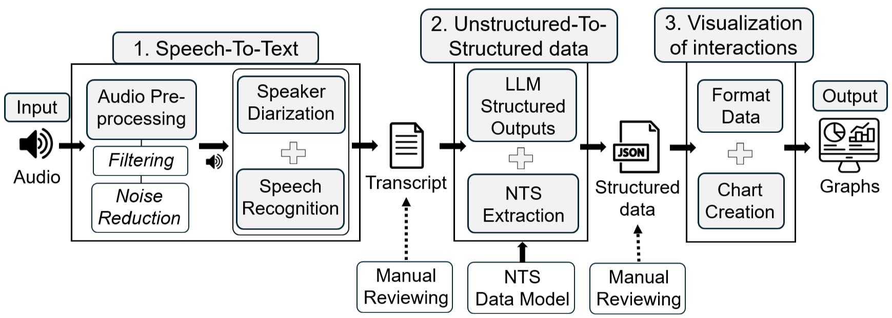

# CRM audio analysis pipeline

The objective of this paper is to provide an exploratory analysis about the feasibility of identifying NTS by using dialogues that take place in a CRM scenario. This repository implements the research methodology in three independent but connected phases:

- 1-Speech-To-Text
- 2-Unstructured-To-Structured data
- 3-Visualization of interactions

Each part of the pipeline is evaluated as an independent process, using the associated technologies to check the feasibility of automating each one. The full automatic assessment is not possible because of the varying technological maturity of each phase; only the feasibility of extracting NTS will be evaluated.

---

## Main scripts (simplified useful scripts)

- `1.code_detectAudio.py`: Part of the Speech-To-Text phase. Uses WhisperX to generate transcription of audio file.
- `2.code_generateTranscription.py`: Part of the Speech-To-Text phase. Simplifies WhisperX output JSON into a text file with timestamps. It will be used as an input for the LLM.
- `3.0.code_extractActions.ipynb`: Part of the Unstructure-to-Structure phase. It connects to OpenAI to run prompts on transcriptions and extract JSON outputs.
- `3.1.JoinResults.ipynb`: Part of the Unstructure-to-Structure phase. It allows to join all the output results from different LLM iterations and avoid duplicates.
- `4.code_neo4jKG.ipynb`: Part of the Visualizations phase. It converts LLM JSON outputs into nodes and edges for a graph DB. It also connects to Neo4j sandbox and ingest data.

## CRM scenarios
CRM scenarios were chosen over other types because of their standardization guidelines, protocols and communications. In this context, any action (e.g., distributing tasks, checking measures or accessing resources) needs to be announced previously, so it can be extracted from the audio. For this reason, four typical CRM scenarios that cover different types of training simulations were chosen from Youtube public videos to provide replicability of the experiments.

- [A-Cardiac](https://www.youtube.com/watch?v=jQYHQr3ebLo): Cardiac Arrest Management Demo. Resuscitation Council UK. YouTube. 
- [B-Clinical](https://www.youtube.com/watch?v=Nq0e1zeIr7g): Angina in Emergency Room - FTCC Multidisciplinary Simulation Clinical. Fayetteville Technical Community College. YouTube. 
- [C-EMS](https://www.youtube.com/watch?v=wP2IQqlf_Ng): Crew Resource Management (CRM) Example - Correct /& Incorrect Animation. Safety Unlimited, Inc. YouTube. 
- [D-Boeing](https://www.youtube.com/watch?v=rX1p-uB6Tco): Busy Jim - Old Continental CRM Training Video (Boeing 737). Flightorg. YouTube. 

## Speech-To-Text

This category covers everything related to converting audio into usable transcripts and speaker-labeled text.

### Automated Speech Recognition and Speaker Diarization (ASR-and-SD)

Purpose:

- Load the CRM audio file (cardiacEscenario.wav or .mp4).
- Run ASR and SD solution.
- Save raw result transcription (with diarization).
- Manually count Word Error Rate (WER) and Word Diarization Error Rate (WDER) compared with "manual_trancription.txt".

Main solutions:

- Google Cloud STT service: This service offers ASR and SD. v1 script (`GoogleCloudSTT/v1_fullAudio.py`) requires enabling the billing in the Google Cloud account and [Google Cloud Speech-to-Text API](https://cloud.google.com/speech-to-text). Google Cloud [v2 STT service](https://cloud.google.com/speech-to-text/docs/transcription-model) requires further configuration in Google Cloud: Creating a bucket in the Cloud Storage in which an audio file needs to be sent, creating a recognizer with same parameters specified in STT v1, and configure both in the available regions that allow SD and automatic punctuation (`no script is needed`). Results can be collected directly from Cloud platform.

- Pyannote-audio is a Python open-source toolkit for just SD. It requires CUDA Toolkit version for the hardware architecture and Operating System. Also it is necessary to install PyTorch with compatible CUDA library setups. Permissions need to be given to the script for accessing the segmentation-3.0 module and speaker-diarization-3.1 module. Script can then be run to diarize audio (`Pyannote/pyannoteaudio.py`)

- Whisper: OpenAI Whisper is a Python open-source toolkit for ASR, and also needs compatibility with Pytorch. A script can run with the correspondant whisper library (`Whisper/transcribe.py`).

- HuggingFace Diarization: Models that are built on top of Pyannote for SD. [3D Speaker](https://github.com/modelscope/3D-Speaker), [NeMo](https://github.com/NVIDIA-NeMo/NeMo) or [WeSpeaker](https://github.com/wenet-e2e/wespeaker). SD runs in Huggingface model's pages (`no script is needed`), and needs HuggingFace token.

- WhisperX: WhisperX is a library that provides fast ASR and SD, and does not require synchronization between two different transcript tools. In order to facilitate the setup, `whisperx-web-ui` library is used. Script runs in `WhisperX/1.code_detectAudio.py`.

Transcription results `1.Speech-To-Text/ASR-and-SD/` folder:

- Google Cloud STT: 
-- `GoogleCloudSTT/results_v1p1beta1_full_easyView_speakers4to7.txt`
-- `GoogleCloudSTT/results_v2_full_easyView_speakers1to6.txt`
-- `GoogleCloudSTT/results_v2_full_easyView_speakers4to7.txt`
- Pyannote:
-- `Pyannote/result_easyview.txt`
-- `Pyannote/whisperx_transcription_cardiac_speakersFixed.txt` contains the results with speakers diarization fixed.
- Whisper: 
-- `Whisper/results_full.json`
- HuggingFace:
--`HuggingFace Diarization/results_3dSpeakerLargeOnnx_pyannote.txt`
--`HuggingFace Diarization/results_NeMo_large.txt`
--`HuggingFace Diarization/results_wespeaker_resnet293.txt`
--`HuggingFace Diarization/results_whisperBase.txt`
--`HuggingFace Diarization/whisperx_transcription_cardiac_speakersFixed.txt` contains the results with speakers diarization fixed.
- WhisperX:
-- `WhisperX/results_*/...`

### Audio preprocessing

WhisperX and A-Cardiac were chosen to run preprocessing techniques. 

Purpose:
- Test the effect of frequency filtering and noise reduction on transcript quality. 
- Save raw result transcription (with diarization).
- Manually count WER and WDER compared with "manual_trancription.txt".

Script runs in `1.Speech-To-Text/preprocessing/1.code_detectAudio.py`.

Results:

- `1.Speech-To-Text/preprocessing/*Cardiac_*/results_whisperx_speaker_filter_*.json`

Transcript generation from diarized JSON converts from .json files into readable transcript TXT. It groups text utterances by speaker, and adds timestamps after each sentence. Main script: `code_generateTranscription.py`.

Plain text transcripttion results:
- `1.Speech-To-Text/preprocessing/transcription_results_whisperx_speaker_filter_*.txt`

---

## Unstructured-To-Structured data

This category covers the transformation of raw conversation transcriptions into structured records of orders, participants, and NTS.

### NTS model

Main file: `2.Unstructured-To-Structured/context/NTS_Model.py`

Purpose:

- Define the pydantic schema for CRM participants, orders, actions, and NTS.
- It defines how the LLM output is expected to be structured.
- Structure the extracted data in a consistent format.

Main classes in the model:

- `Participant`: Represents one of the participants of the audio recording. Contains the speaker id, the nickname or role (mentioned by someone else during the recording). A participant can be used as an attribute of other classes.
- `Order`: Defines what a participant orders to another one. Order contains the leader and follower participants (with their attributes from the Participant class), the ordered action, and the start and stop timestamps.
- `Skill`: Describes a NTS of a participant in a certain moment. NTS contains the speaker (with all the attributes from Participant class), the main NTS principle that participant is following (i.e., Environmental awareness, Team management, Dynamic decision making and Resource Allocation), the skill description with additional information from the NTS, the action that represents the NTS, and the start and stop timestamps.
- `Orders`: The CRM scenario can be represented as a list of objects of Order class between participants.
- `CRMSkills`: The CRM scenario can be represented as a list of objects of Skill (NTS) class if each participant.

### Prompt design for extraction

Main file: `2.Unstructured-To-Structured/context/prompts.txt`

Purpose:

- Define the instructions given to the LLM to detect participants, orders, and NTS
- Encode the task definitions used for extraction from transcript text
- Support different prompt variants used during experimentation

Relevant information in the prompts:

- Participant name and role identification
- Order detection from imperative or implied statements
- NTS categories such as team management, resource allocation, environmental awareness, and dynamic decision-making
- Inference rules when identity is uncertain

Notes:

- The project treats these prompts as part of a research prototype rather than a finalized production prompt design.

### Ground-truth
Ground-truth has been defined in order to compare LLM outputs performance. Two reviewers (pablo and mcp) labeled each utterance in the transcriptions and are set in a JSON file for each CRM scenario: `2.Unstructured-To-Structured/ground-truth/manual_*.json`

Interrater Jaccard-based agreement scores are computed based on both .json files, with script `2.Unstructured-To-Structured/ground-truth/interrater_jaccard.py`

### LLM-based extraction of Orders and NTS

Notebook that connects to OpenAPI: `2.Unstructured-To-Structured/1.1.code_extract actions.ipynb`

Purpose:
- Use the transcript and prompt to extract structured orders and non-technical skills. Transcription inputs are located in `2.Unstructured-To-Structured/input/transcription_*`
- Assign timestamps to each detected order or NTS.
- Infer participant names and roles when possible.

Expected outputs from five iterations:

- `2.Unstructured-To-Structured/1. cardiac/` with `orders_*.json` and `skills_*.json`
- `2.Unstructured-To-Structured/2. clinical/` with `orders_*.json` and `skills_*.json`
- `2.Unstructured-To-Structured/3. crmboeing/` with `orders_*.json` and `skills_*.json`
- `2.Unstructured-To-Structured/4. crmscripted/` with `orders_*.json` and `skills_*.json`

Notebook that joins all the iteration results: `2.Unstructured-To-Structured/1.2.JoinResults.ipynb`. Output merged results: `2.Unstructured-To-Structured/merged_results/merged_*.json`

Merged orders and NTS are later collected into a simplified JSON with two scripts: `2.Unstructured-To-Structured/dump_results_merged.py` and `dump_results.py`. First one dumps LLM simplified JSON into `2.Unstructured-To-Structured/iteration_results/iteration_*`, while second one into `2.Unstructured-To-Structured/merged_results/*_timeline_*.json`

### Structured outputs performance

Once the LLM results are extracted, the results-evaluation scripts run:

- `2.Unstructured-To-Structured/analyze-metrics-nts.py`
- `2.Unstructured-To-Structured/analyze-metrics-orders.py`

Purpose:
- Compare LLM outputs with manually annotated ground truth.
- Calculate precision, recall and F1-score.
- Assess the quality of the extracted orders and NTS.

---

## Visualization of interactions

This category covers the conversion of extracted structured outputs into visual representations of participants' interactions and NTS behaviors. Four types of charts are proposed with different approaches:

- Speakers timeline: This chart allows to identify which speaker talked during which times along the whole audio duration. This chart needs that LLM output in JSON structure is formatted into Rich Transcription Time Marked (RTTM) annotation.
- Orders and NTS Gantt chart: This Gantt chart provides additional information about the CRM interactions. Orders between participants are formatted into 'Speaker to Speaker: Order' (e.g., Mandy to Keith: Manage defibrillation) and NTS in the format of 'Speaker: NTS' (e.g., Keith: Dynamic Decision-making).
- Orders and NTS Pie chart: It is possible to show with this chart the amount of interactions of each type that a participant did, as well as the participants that have each NTS. To show this type of graph, it is necessary to count interactions from the LLM order and NTS outputs and generate percentages. 
- KG visualization: This visualization allows to show all the orders and NTS from speakers, in a KG view. This view provides an opportunity to see the connections between speakers and the NTS, as well as the orders between speakers, offering a good overview of the interactions that took place during the scenario, in order to find communication gaps, and which participant is more related to specific NTS. KG visualizations are composed of objects (i.e., nodes), symbolized by circles, and relations between them (i.e., edges), represented by directional arrows. In this case, there are two types of nodes based on the NTS model: speakers and NTS. LLM outputs are transformed into nodes and edges, allowing to link speakers to NTS and speakers between them. The relation between speakers represents an order in the direction of the participant giving the command, not the one giving the answer, since given OpenAI prompt is not obtaining ACKs. ACKs to orders are an indicator of good communication between participants so it could valuable for detecting issues in the communication. 

### Speakers timeline

Notebook: `3.Visualizations/Timelines/code_showResults.ipynb`

Purpose:
- Inspect speaker times distributions.
- Show who spoke and when.
- Validate the temporal structure of the conversation.

Results: `3.Visualizations/Timelines/rttm_detected.png`

### Gantt chart

Script: `3.Visualizations/GanttCharts/ConvertJson2Gantt.py`

Purpose:
- Transform structured JSON into data suitable for timeline visualizations.
- Convert orders and skills into a chart-friendly format.

Results:
- `3.Visualizations/GanttCharts/gantt_*_timeline_orders.png`
- `3.Visualizations/GanttCharts/gantt_*_timeline_skills.png`

### Pie chart

Script: `3.Visualizations/Metrics/generateMetrics.py`

Purpose:
- Transform structured JSON into data suitable for metric distribution visualizations.
- Convert orders and skills into a chart-friendly format.

Results:
- `3.Visualizations/Metrics/cardiac/metrics_cardiac*.png`
- `3.Visualizations/Metrics/clinical/metrics_clinical*.png`
- `3.Visualizations/Metrics/crmboeing/metrics_crmboeing*.png`
- `3.Visualizations/Metrics/crmscripted/metrics_crmscripted*.png`

### Knowledge graph

Neo4j configuration, credentials, and ingestion workflow are not fully documented in the repository. Neo4j sandbox needs to be setup. Notebook to generate KG: `2.code_neo4jKG.ipynb`

Purpose:
- Transform extracted events into nodes and edges.
- Connect speakers to one another and to NTS categories
- Ingest the result into Neo4j for network analysis

This type of graph is useful for:

- Understanding communication patterns.
- Identifying dominant participants.
- Observing which types of NTS are connected to each speaker.
- Detecting communication gaps or bottlenecks.

---

## Project interpretation

This repository should be interpreted as a research prototype pipeline to extract NTS, rather than a single runnable application. The code is organized around the three methodological blocks described in the paper:

1. Speech-To-Text
2. Unstructured-To-Structured data
3. Visualization of interactions

Within each block, there are distinct processes, some fully automated in code and others partly manual or external dependent. This separation is intentional and matches the methodology used in the study.

